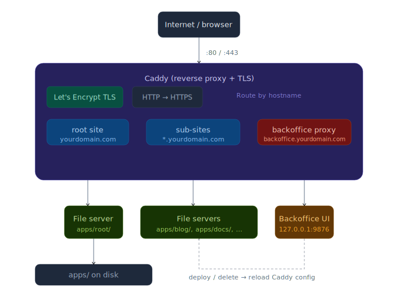

# sitehost

A minimal static site host powered by [Caddy](https://caddyserver.com/) and Go. Drop a ZIP into a web UI and your site is live — with automatic HTTPS via Let's Encrypt, or on localhost with zero config.

---

## Architecture



## Features

- **One-command deploy** — upload a ZIP or a single HTML file through the browser UI
- **Automatic HTTPS** — Let's Encrypt certificates managed by Caddy, no configuration needed
- **SPA support** — auto-detected; all unknown paths fall back to `index.html`
- **Subdomain routing** — each site lives at `<name>.<your-domain>.com`
- **Localhost mode** — no domain needed; sites are served on sequential ports (`9000`, `9001`, …)
- **Auto landing page** — when no root site exists, a generated index links to all hosted sites
- **Backoffice UI** — password-protected dashboard to deploy and delete sites
- **Systemd integration** — `make install` sets up a service that starts on boot

---

## Requirements

- Go 1.21+
- A server with ports 80/443 open (for domain mode), or just a local machine (for localhost mode)
- A domain with a wildcard DNS record pointing to your server (domain mode only)

---

## Quick Start

### Localhost (no domain, no sudo)

```bash
git clone https://github.com/you/sitehost
cd sitehost
SITEHOST_PASS=dev make run-local
```

| URL                     | What                |
| ----------------------- | ------------------- |
| `http://localhost:9000` | Root / landing page |
| `http://localhost:9001` | First deployed site |
| `http://localhost:8999` | Backoffice UI       |

### Domain mode

```bash
# 1. Point *.yourdomain.com → your server IP (DNS)
echo "yourdomain.com" > apps/root.txt

# 2. Run (needs ports 80/443)
SITEHOST_PASS=supersecret make run
```

| URL                                 | What                |
| ----------------------------------- | ------------------- |
| `https://yourdomain.com`            | Root / landing page |
| `https://mysite.yourdomain.com`     | Site named "mysite" |
| `https://backoffice.yourdomain.com` | Backoffice UI       |

---

## Directory Layout

```
sitehost/
├── apps/                  # Your sites live here
│   ├── root.txt           # (optional) your domain — omit for localhost mode
│   ├── root/              # Served at the apex domain / port 9000
│   ├── blog/              # → blog.yourdomain.com / port 9001
│   └── docs/              # → docs.yourdomain.com / port 9002
├── internal/
│   ├── backoffice/        # Web UI handler + embedded template
│   ├── builder/           # Caddy config construction
│   ├── config/            # root.txt reader
│   ├── landing/           # Auto-generated landing page
│   └── sites/             # Site discovery + SPA detection
└── main.go
```

### Site structure

Each subdirectory of `apps/` is a site. The directory name becomes the subdomain (or `root` for the apex domain).

```
apps/
└── myblog/
    ├── index.html         # Required
    ├── assets/            # Presence of this (or static/, _next/, dist/) marks site as SPA
    └── ...
```

**SPA detection** — a site is treated as a single-page app when it contains `index.html` **and** one of the bundler output directories: `assets/`, `static/`, `_next/`, `dist/`. All unmatched paths are rewritten to `/index.html`.

---

## Deploying a Site

### Via the backoffice UI

1. Open the backoffice (see URLs above) and log in with your credentials.
2. Enter a site name (letters, numbers, hyphens, underscores).
3. Upload a `.zip` of your build output **or** a single `.html` file.
4. Click **Deploy** — the site is live immediately.

> **ZIP tip:** you can upload the contents of your `dist/` folder directly. If the ZIP has a single top-level folder, it is stripped automatically.

### Via the filesystem

Copy your build output into `apps/<name>/` and restart the service:

```bash
cp -r dist/ apps/mysite/
make restart
```

---

## Makefile Reference

| Command          | Description                                           |
| ---------------- | ----------------------------------------------------- |
| `make build`     | Compile the binary                                    |
| `make run`       | Run in the foreground with a real domain (needs sudo) |
| `make run-local` | Run on localhost — no domain, no sudo                 |
| `make install`   | Build, install binary, create systemd service         |
| `make uninstall` | Stop and remove the service and binary                |
| `make up`        | Start the systemd service                             |
| `make down`      | Stop the systemd service                              |
| `make restart`   | Restart (picks up new sites automatically)            |
| `make status`    | Show service status                                   |
| `make logs`      | Follow live logs                                      |
| `make clean`     | Remove compiled binary                                |

---

## Production Install (systemd)

```bash
# 1. Install binary + service (prompts for a password)
make install

# 2. Start
make up

# 3. Follow logs
make logs
```

Credentials are stored in `/etc/sitehost/env` (mode `600`). Re-running `make install` keeps existing credentials.

The service runs with `CAP_NET_BIND_SERVICE` so it can bind to ports 80/443 without running as root.

---

## Environment Variables

| Variable        | Default      | Description         |
| --------------- | ------------ | ------------------- |
| `SITEHOST_USER` | `admin`      | Backoffice username |
| `SITEHOST_PASS` | _(required)_ | Backoffice password |

---

## How It Works

1. **Startup** — `main.go` reads `apps/root.txt` to determine the mode (domain vs. localhost).
2. **Discovery** — `sites.Discover()` scans `apps/` for subdirectories and detects SPAs.
3. **Config build** — `builder` constructs a Caddy JSON config in memory:
   - Domain mode: one HTTPS server, one route per subdomain, HTTP→HTTPS redirect, Let's Encrypt TLS.
   - Localhost mode: one TCP listener per site on sequential ports, no TLS.
4. **Caddy** is started (or reloaded) with the generated config — no Caddyfile on disk.
5. **Backoffice** runs as a plain Go HTTP server on `127.0.0.1:9876`, reverse-proxied through Caddy so it gets the same HTTPS treatment as everything else.
6. **On deploy/delete** — the backoffice calls `onReload()`, which re-runs steps 2–4 with the updated site list.

---

## License

MIT
