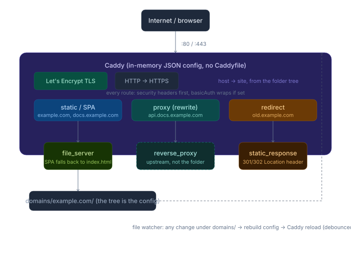

# zipgo


A minimal static site host powered by [Caddy](https://caddyserver.com/) and Go. Drop a domain folder into `.zipgo/` and your sites are live — with automatic HTTPS via Let's Encrypt, or on localhost with zero config.

---

## Architecture



## Features

- **Drop-in deploy** — create a domain folder under `.zipgo/`; changes are picked up automatically
- **Automatic HTTPS** — Let's Encrypt certificates managed by Caddy, no configuration needed
- **Filesystem-as-config** — the folder tree _is_ the routing table; no config files to maintain
- **Recursive subdomains** — a folder ending in a dot (`docs.`) becomes a subdomain; nest them for sub-subdomains
- **Multiple domains** — host several domains at once, each in its own folder
- **SPA support** — auto-detected; all unknown paths fall back to `index.html`
- **Localhost mode** — no domain needed; all sites served on a single port (`9000`) with path routing
- **Systemd integration** — `zipgo enable` sets up a user service that starts on boot

---

## Requirements

- Go 1.21+
- A server with ports 80/443 open (for domain mode), or just a local machine (for localhost mode)
- DNS records pointing each domain (and its subdomains) to your server (domain mode only)

---

## Quick Start

### Localhost (no domain, no sudo)

```bash
git clone https://github.com/GabrielVidal1/zipgo
cd zipgo
make run-local
```

In localhost mode every site is reachable on a single port under a path that mirrors its host:

| URL                                        | What                          |
| ------------------------------------------ | ----------------------------- |
| `http://localhost:9000/yourdomain.com`     | The apex site                 |
| `http://localhost:9000/yourdomain.com/docs`| The `docs.` subdomain         |

### Domain mode

```bash
# 1. Create a domain folder and point its DNS records at your server
mkdir -p .zipgo/yourdomain.com
echo "<h1>hello</h1>" > .zipgo/yourdomain.com/index.html

# 2. Run (needs ports 80/443)
make run
```

| URL                              | What                  |
| -------------------------------- | --------------------- |
| `https://yourdomain.com`         | The apex site         |
| `https://docs.yourdomain.com`    | The `docs.` subdomain |

---

## Directory Layout

The domains folder (default `.zipgo/`, override with `ZIPGO_DOMAINS_FOLDER`) holds one folder per domain. **A domain folder name must contain a dot** — folders without one are ignored.

```
.zipgo/
└── yourdomain.com/            # one folder per domain (name must contain a dot)
    ├── index.html             # the apex site — served at yourdomain.com
    ├── assets/                # regular content, served as a path under the apex
    ├── docs./                 # → docs.yourdomain.com
    │   ├── index.html
    │   └── api./              # → api.docs.yourdomain.com  (recursive)
    └── blog./                 # → blog.yourdomain.com
```

### Subdomain rule

Inside a domain folder, **any subdirectory whose name ends in a dot is a subdomain**. The label is the name with the trailing dot removed, and the rule applies recursively:

| Folder                              | Host                          |
| ----------------------------------- | ----------------------------- |
| `yourdomain.com/` (the root itself) | `yourdomain.com`              |
| `yourdomain.com/docs./`             | `docs.yourdomain.com`         |
| `yourdomain.com/docs./api./`        | `api.docs.yourdomain.com`     |
| `yourdomain.com/foo.bar./`          | `foo.bar.yourdomain.com`      |

Folders that do **not** end in a dot are treated as ordinary content of their parent site (served as paths). Subdomain folders are hidden from the apex's directory listing, so they don't leak into `https://yourdomain.com/`.

### Site structure

The domain folder root is the apex site; each subdomain folder is its own site.

```
yourdomain.com/
├── index.html         # entry point
├── assets/            # presence of this (or static/, _next/, dist/) marks the site as an SPA
└── ...
```

**SPA detection** — a site is treated as a single-page app when it contains `index.html` **and** one of the bundler output directories: `assets/`, `static/`, `_next/`, `dist/`. All unmatched paths are rewritten to `/index.html`.

---

## Deploying a Site

Copy your build output into the right folder. The file watcher picks up changes automatically and reloads Caddy:

```bash
# apex
cp -r dist/* .zipgo/yourdomain.com/

# a subdomain (note the trailing dot)
cp -r dist/ .zipgo/yourdomain.com/app./
```

---

## CLI

```bash
zipgo serve     # start the server (default when no command is given)
zipgo enable    # install and start the systemd user service
zipgo disable   # stop and remove the systemd user service
zipgo status    # show service status
zipgo help      # usage
```

---

## Makefile Reference

| Command          | Description                                           |
| ---------------- | ----------------------------------------------------- |
| `make build`     | Compile the binary (also regenerates install scripts) |
| `make run`       | Run in the foreground with a real domain (needs sudo) |
| `make run-local` | Run on localhost — no domain, no sudo                 |
| `make run-prod`  | Grant port-binding capability and run in domain mode  |
| `make format`    | Run gofmt                                             |
| `make clean`     | Remove compiled binary                                |

---

## Environment Variables

| Variable                | Default   | Description                                        |
| ----------------------- | --------- | -------------------------------------------------- |
| `ZIPGO_DOMAINS_FOLDER`  | `.zipgo`  | Folder scanned for domain subfolders               |
| `ZIPGO_LOCALHOST`       | _(off)_   | Set to `1` to force localhost mode (single port)   |

If the domains folder contains no valid domain folders, zipgo automatically falls back to localhost mode.

---

## How It Works

1. **Startup** — `main.go` reads `ZIPGO_DOMAINS_FOLDER` (default `.zipgo`) and lists its domain subfolders. No domains (or `ZIPGO_LOCALHOST=1`) → localhost mode.
2. **Discovery** — `sites.Discover()` walks each domain folder: the root is the apex, and every dot-suffixed subfolder is a subdomain, recursively. SPAs are auto-detected.
3. **Config build** — `builder` constructs a Caddy JSON config in memory:
   - Domain mode: one HTTPS server, one route per host, HTTP→HTTPS redirect, Let's Encrypt TLS (exact host subjects).
   - Localhost mode: a single listener on port `9000` with path routing, no TLS.
4. **Caddy** is started (or reloaded) with the generated config — no Caddyfile on disk.
5. **File watcher** — changes under the domains folder trigger a debounced `reload()`, re-running steps 2–4 with the updated site list.

---

## License

MIT
